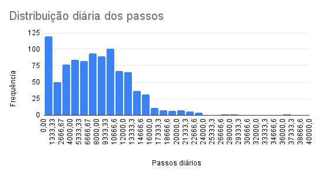
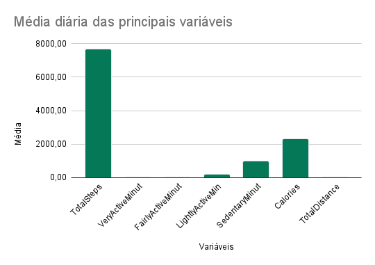
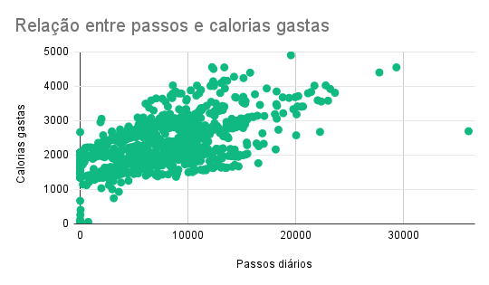

# 🧠 Estudo de Caso Bellabeat — Análise de Dados para Estratégia de Marketing

📄 **Contexto**  
Este projeto faz parte do estudo de caso _"Como uma empresa de tecnologia para bem-estar pode agir de forma estratégica?"_, proposto no curso de Análise de Dados. O objetivo foi investigar tendências de uso em dispositivos fitness para gerar recomendações de marketing para a Bellabeat — uma empresa focada em produtos voltados para a saúde da mulher.

---

🎯 **Tarefa do negócio**  
Identificar tendências no uso de dispositivos inteligentes e sugerir como a Bellabeat pode aplicar essas tendências à sua estratégia de marketing.

---

🧠 **Etapas do processo**  
- **Perguntar:** Entendi o problema que a Bellabeat precisa resolver — identificar tendências que influenciem o marketing.  
- **Preparar:** Obtive o dataset [Fitbit Fitness Tracker Data](https://www.kaggle.com/arashnic/fitbit) do Kaggle e examinei os campos disponíveis.  
- **Processar:** Limpei os dados, removi inconsistências e outliers utilizando o Google Sheets.  
- **Analisar:** Calculei estatísticas descritivas e identifiquei tendências no uso.  
- **Compartilhar:** Criei visualizações para apresentar os insights.  
- **Agir:** Gere recomendações para a estratégia de marketing da Bellabeat.

---

## 📊 Estudo de Caso Bellabeat

### 📊 Distribuição diária dos passos

### 📊 Média diária das principais variáveis

### 📊 Relação entre passos e calorias gastas

---

📝 **Sobre o estudo**  
Este estudo analisa tendências de uso de dispositivos fitness, focando em passos diários, calorias gastas e outras variáveis. Foram utilizadas técnicas de análise e visualização para responder às perguntas de negócio da Bellabeat e propor recomendações para o time de marketing.

---

📊 **Principais resultados**  
- 🚶‍♂️ Os usuários dão, em média, **7.638 passos por dia**.  
- 🏃‍♀️ Uso de atividades muito intensas ocorre apenas **21 min/dia**.  
- 🪑 Os usuários permanecem sedentários por cerca de **991 min/dia (~16 horas/dia)**.

---

🎯 **Recomendações**  
- Focar em campanhas que incentivem o aumento de passos e a redução do sedentarismo.  
- Usar notificações personalizadas para engajar os usuários.  
- Promover desafios que estimulem maior atividade intensa entre os usuários.

---

🔧 **Ferramentas usadas**  
- **Google Sheets** — limpeza e análise exploratória  
- **GitHub** — versionamento e compartilhamento do estudo  

---

🔗 **Dados**  
Dataset: [Fitbit Fitness Tracker Data](https://www.kaggle.com/arashnic/fitbit)

---

✉️ **Contato**  
Se você tem interesse em saber mais sobre este estudo, entre em contato:  
- 📧 **Email:** sdanmesquita@gmail.com  
- 💼 **LinkedIn:** [www.linkedin.com/in/daniel-mesquita-183270256](https://www.linkedin.com/in/daniel-mesquita-183270256)

---

